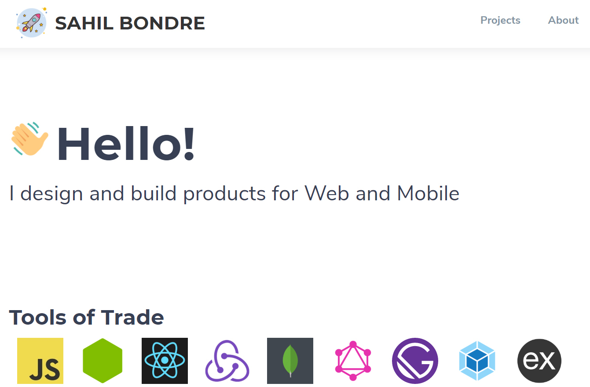

# Portfolio

Personal portfolio made with Gatsby and JAMstack

## Getting Started

These instructions will get you a copy of the project up and running on your local machine for development and testing purposes. See deployment for notes on how to deploy the project on a live system.

### Prerequisites

- [Node](https://nodejs.org/)
- [Gatsby](https://www.gatsbyjs.org/)
- [Surge](http://surge.sh) (For Deployment)

### Installing

- `$ git clone https://github.com/godcrampy/portfolio.git`
- `$ npm install`
- `$ gatsby develop`

## Deployment

- `$ gatsby build`
- `$ surge public/`

## Built With

- [Gatsby](https://www.gatsbyjs.org/)
- [Surge](http://surge.sh)
- [React](https://reactjs.org/)
- [Sass](https://sass-lang.com/)

## Contributing

1. Fork this repo
2. Create a new branch
3. Commit your changes
4. Push to the branch
5. Send a PR

## Showcase

## Authors

- **Sahil Bondre** - [godcrampy](https://github.com/godcrampy)

## Contributers

- **Aemie Jariwala** - [AemieJ](https://github.com/AemieJ)
