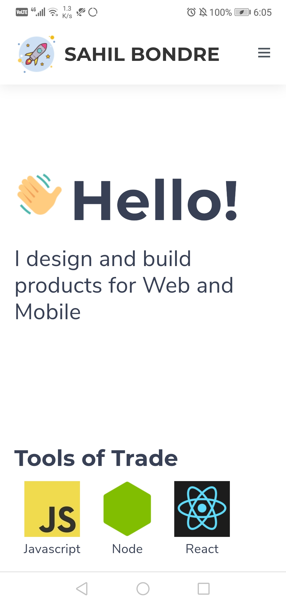
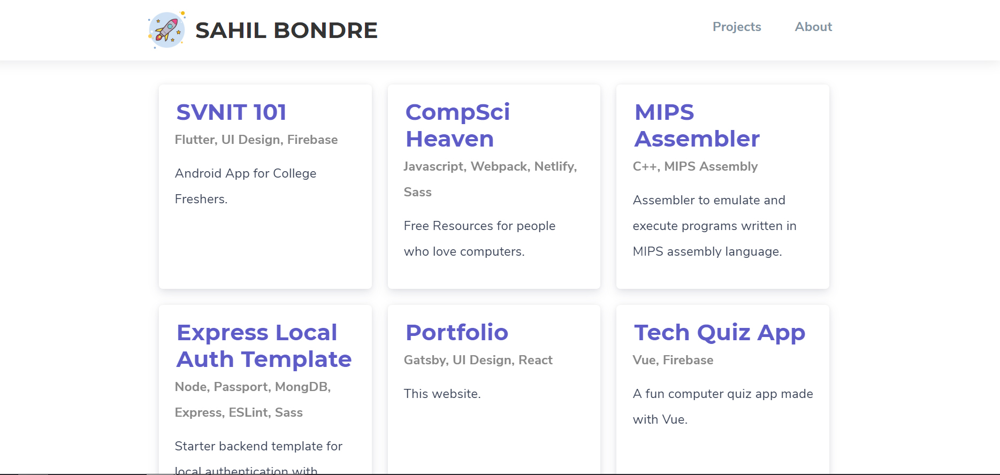

# Portfolio
> That's Javascript and I am going to run that.

## Insight to Project

Portfolio covers all the projects I have worked on and an insight about me .

The entire project was implemented mainly using gatsby and jamstack . Sass and javascript were majorily used for 
the designing purpose . The code avoided the use of any html pages as all the html tags were encoded within the javascript itself .

React is a JavaScript library for building user interfaces with which you can encode the html tags itself and run the entire program . 

Gatsby is a free and open source framework based on React and it was used to build faster website . JAMstack stands for JavaScript, APIs, and Markup and is preferred to create a flexible and an easier web development architecture based on client-side javascript , resuable APIs and prebuilt Markup .

## Built With

* [React](https://reactjs.org/)
* [Gatsby](https://www.gatsbyjs.org/)
* [JAMstack](https://jamstack.org/)
* [Sass](https://sass-lang.com/)

## Contributing

1. Fork it (<https://github.com/godcrampy/portfolio/fork>)
2. Create your feature branch
3. Commit your changes
4. Push to the branch
5. Create a new Pull Request

## Showcase 

## Authors

* **Sahil Bondre** - *Initial work* - [godcrampy](https://github.com/godcrampy)